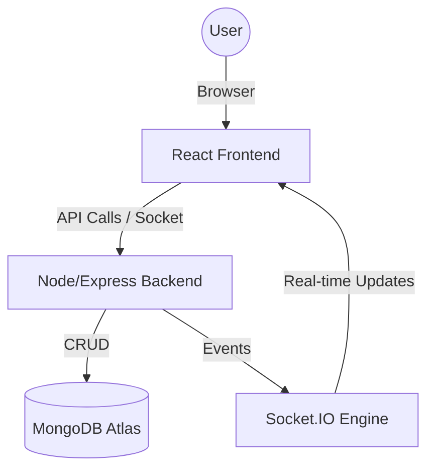

# 🍔 Befoody - Your Local Neighborhood Food Hub

Welcome to **Befoody**! This is a modern, high-performance, and fully responsive food delivery platform. Whether you're a hungry customer, a busy restaurant owner, or a delivery hero, Befoody provides a seamless experience for everyone in the food ecosystem.

🚀 **Live Demo:** [Check it out here!](https://developer-yasir.github.io/befoody)

---

## ✨ What makes Befoody special?

Befoody isn't just another food app; it's built with a **Mobile-First** mindset. We've dedicated significant effort to ensuring that both the **Rider** and **Restaurant** dashboards feel like premium native apps on your phone.

### 📱 Dashboard Deep-Dive
- **Premium Rider App:** 
  - **Online/Offline Toggle:** Riders can control their availability.
  - **Live Order View:** Real-time updates for active deliveries with map indicators.
  - **Earnings Insights:** Comprehensive view of daily and total earnings.
  - **Mobile-First Navigation:** Bottom navigation for quick access to Home, Earnings, History, and Profile.
- **Smart Kitchen Hub (Restaurant):** 
  - **Live Kanban Board:** Efficiently manage orders through status columns (New, Kitchen, Ready, Out).
  - **Menu Management:** Real-time availability toggles, price updates, and item deletion.
  - **Mobile-Specific Layouts:** Tabbed views for orders, menu, and analytics on smaller screens.
- **Beautiful Customer Experience:** 
  - **Guest Checkout:** Order food without needing to create an account.
  - **Advanced Search & Filtering:** Filter by cuisine types, price ranges, and ratings.
  - **Live Tracking Timeline:** Visual progress bar for your order's journey.

---

## 🏗️ Project Structure

Explore the codebase with ease:

### **Frontend (`/frontend`)**
- `src/components/`: Reusable UI components (Navbar, Footer, Modals).
- `src/components/rider/`: Mobile-specific sub-components for the Rider dashboard.
- `src/components/restaurant/`: Mobile-specific navigation and UI for restaurants.
- `src/pages/`: Main page views (Home, Checkout, Dashboards).
- `src/context/`: State management for Authentication and Toast notifications.
- `src/services/`: API interaction logic using Axios.
- `src/utils/`: Shared helper functions and constants.

### **Backend (`/backend`)**
- `index.js`: Main entry point, server configuration, and Socket.IO initialization.
- `models/`: Mongoose schemas for Users, Restaurants, FoodItems, and Orders.
- `routes/`: Express API routes categorized by resource.
- `middleware/`: Custom logic for authentication check and error handling.
- `uploads/`: Static storage for uploaded product and restaurant images.

---

## 🛠️ Built With

We use a modern tech stack to ensure speed, security, and scalability:

- **Frontend:** React 18 & Vite (Blazing fast development and builds)
- **Styling:** Tailwind CSS (Modern, utility-first design)
- **Backend:** Node.js & Express (Robust and flexible API)
- **Database:** MongoDB & Mongoose (Reliable data storage)
- **Real-time:** Socket.IO (Live order updates and rider tracking)
- **Auth:** JWT (Secure and stateless authentication)

---

## 🚀 Getting Started

Want to run Befoody on your local machine? It's easy!

### 1. Clone & Install
```bash
git clone https://github.com/developer-yasir/befoody.git
cd befoody
```

### 2. Backend Setup
```bash
cd backend
npm install
```
Create a `.env` file in `/backend`:
```env
PORT=5000
MONGO_URI=your_mongodb_connection_string
JWT_SECRET=your_jwt_secret_key
FRONTEND_URL=http://localhost:5173
```
Start the server:
```bash
npm run dev
```

### 3. Frontend Setup
```bash
cd ../frontend
npm install
```
Create a `.env` file in `/frontend`:
```env
VITE_API_BASE_URL=http://localhost:5000
```
Start the app:
```bash
npm run dev
```

---

## 🔐 Try it out (Demo Accounts)

No need to register! Use these pre-configured accounts to explore the different roles:

| Role | Email | Password | What to expect? |
|------|-------|----------|-----------------|
| **Admin** | `admin@befoody.com` | `admin123` | Full control over the system |
| **Restaurant** | `owner@restaurant.com` | `password123` | Manage orders & update your menu |
| **Rider** | `alex.rider@befoody.com` | `password123` | Go online and start delivering |
| **Customer** | `john.doe@gmail.com` | `password123` | Order your favorite food |

> [!TIP]
> You can also use the **Quick Demo Access** buttons on the login page to jump right in!

---

## 🗺️ How the Magic Happens (Order Flow)

1. **Hungry?** A customer places an order (works even as a guest!).
2. **Ping!** The restaurant gets a real-time notification on their **Kitchen Hub**.
3. **Cooking...** Restaurant confirms and prepares the food.
4. **Ding!** Once ready, a notification goes out to nearby **Riders**.
5. **On the move!** A rider accepts, picks up the food, and delivers it to your door.
6. **Yum!** Order delivered.

---

---

## 🔌 API Reference (Key Endpoints)

Full API documentation for developers:

### **Authentication**
- `POST /api/auth/register`: Create a new user account.
- `POST /api/auth/login`: Authenticate user and receive JWT.

### **Restaurants & Menu**
- `GET /api/restaurants`: Fetch all active restaurants.
- `GET /api/restaurants/:id`: Retrieve detailed info and full menu for a specific restaurant.
- `POST /api/fooditems`: (Restricted) Add new items to a restaurant's menu.

### **Order Management**
- `POST /api/orders`: Create a new order (Guest friendly!).
- `GET /api/orders/my-orders`: Retrieve order history for the logged-in user.
- `PUT /api/orders/:id/status`: (Restricted) Update the status of an order (Kitchen flow).

### **Rider Operations**
- `GET /api/riders/available-orders`: View orders waiting for a rider.
- `POST /api/riders/accept-order`: Claim an order for delivery.

---

## 🛠️ Troubleshooting

Facing issues? Check these common solutions:

- **MongoDB Connection Error:** Ensure your `MONGO_URI` is correct and your IP is whitelisted in MongoDB Atlas.
- **Images Not Loading:** Check if the backend is running and the `/uploads` folder is accessible.
- **Socket Disconnects:** Ensure the `FRONTEND_URL` in the backend `.env` matches your local development port.
- **Role Permission Denied:** Verify your user has the correct role (admin, restaurant, or rider) in the database.

---

## 🔮 Future Roadmap
- [ ] **Apple/Google Pay Integration**: Seamless checkout experience.
- [ ] **Push Notifications**: Real-time alerts even when the app is closed.
- [ ] **Rider Route Optimization**: AI-powered delivery paths.
- [ ] **Customer Reviews & Ratings**: Allowing users to share their food experiences.

---

## 🎨 Architecture Overview



---

## 🤝 Contribution & Feedback

We love community feedback! If you find a bug or have a feature idea, feel free to open an issue or submit a pull request.

- **Found a bug?** Open an Issue.
- **Want to help?** PRs are welcome!
- **Just want to chat?** Reach out to the team.

---

## 📝 License

Distributed under the **MIT License**. See `LICENSE` for more information.

Built with ❤️ by [Yasir](https://github.com/developer-yasir)
